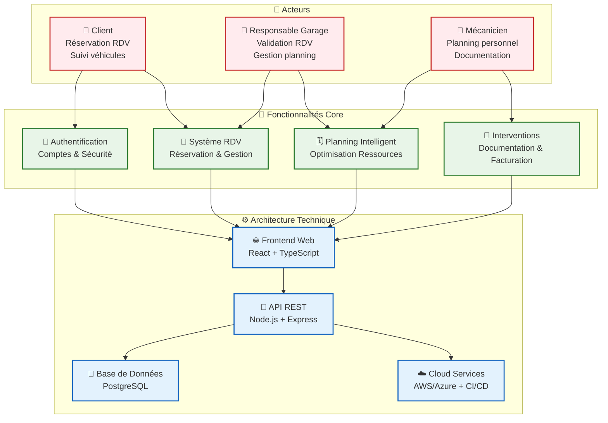
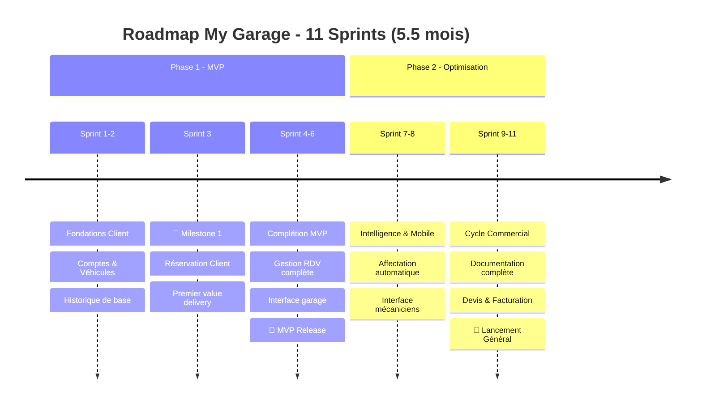

# 🚗 My Garage - Application de Gestion de RDV pour Garage Automobile

## 📋 Description

Application web permettant la gestion complète des rendez-vous et interventions d'un garage automobile. Cette solution digitale facilite la prise de RDV en ligne, la gestion du planning des mécaniciens et le suivi des interventions.

## 🎯 Objectifs

- **Digitaliser** la prise de rendez-vous
- **Optimiser** le planning des mécaniciens
- **Améliorer** l'expérience client
- **Tracer** les interventions et l'historique
- **Automatiser** les processus administratifs

## 📚 Documentation

### 🔗 Navigation Rapide
- **[📋 Index Général](./index.md)** - Vue d'ensemble et navigation complète
- **[📚 Documentation Complète](./docs/index.md)** - Accès à toute la documentation technique

### 🎯 Épics & Fonctionnalités
| Epic | Description | User Stories | Statut |
|------|-------------|-------------|--------|
| **[Epic 01 - Gestion Clients](./docs/epics/EPIC-01-gestion-clients.md)** | Comptes clients et véhicules | US-01, US-02, US-03 | ✅ Spécifiée |
| **[Epic 02 - Prise de RDV](./docs/epics/EPIC-02-prise-rdv.md)** | Système de réservation | US-04, US-05, US-06 | ✅ Spécifiée |
| **[Epic 03 - Planning](./docs/epics/EPIC-03-planning.md)** | Gestion des ressources | US-07, US-08, US-09 | ✅ Spécifiée |
| **[Epic 04 - Interventions](./docs/epics/EPIC-04-interventions.md)** | Cycle des interventions | US-10, US-11, US-12 | ✅ Spécifiée |

### 📐 Règles & Contraintes
- **[Règles Métier](./docs/business-rules/BUSINESS-RULES.md)** - Contraintes fonctionnelles et de gestion

### 📅 Planning & Organisation
- **[Planning Stratégique](./docs/PLANNING-STRATEGIQUE.md)** - Roadmap détaillé et milestones
- **[Guide d'Organisation](./docs/GUIDE-ORGANISATION.md)** - Méthodologie et séquencement optimal
- **[Issues GitHub](https://github.com/tgrall/my-garage/issues)** - Épics et User Stories trackées

### Structure de la Documentation

```
docs/
├── index.md                  # Navigation documentation
├── epics/                    # Épics détaillées
│   ├── index.md             # Index des épics
│   ├── EPIC-01-gestion-clients.md
│   ├── EPIC-02-prise-rdv.md
│   ├── EPIC-03-planning.md
│   └── EPIC-04-interventions.md
└── business-rules/           # Règles métier
    ├── index.md             # Index des règles
    └── BUSINESS-RULES.md
```

## 🚀 Roadmap & Architecture

### 📊 Vue d'ensemble du Projet



### 📅 Planning Stratégique



### Phase 1 - MVP (3 mois)
- ✅ Gestion des comptes clients
- ✅ Prise de RDV basique
- ✅ Planning simple

### Phase 2 - Enrichissement (2 mois)
- 🔄 Gestion complète des interventions
- 🔄 Facturation
- 🔄 Affectation intelligente

### Phase 3 - Optimisation (2 mois)
- 📊 Analytics et reporting
- 💬 Communication automatisée
- 🤖 IA pour suggestions

## 🛠 Stack Technique Suggérée

- **Frontend**: React/Vue.js + TypeScript
- **Backend**: Node.js/Spring Boot
- **Database**: PostgreSQL
- **Cache**: Redis
- **Messaging**: RabbitMQ
- **Storage**: S3/MinIO

## 📈 KPIs Principaux

- Taux de RDV en ligne vs téléphone
- Temps moyen de prise de RDV
- Taux d'occupation des mécaniciens
- NPS (Net Promoter Score)
- Délai moyen d'intervention

## 🤝 Contributeurs

- Product Owner: [À définir]
- Scrum Master: [À définir]
- Dev Team: [À définir]

## 📄 License

Propriétaire - Tous droits réservés

---

## 🔗 Navigation

- **[📋 Index Général](./index.md)** - Vue d'ensemble complète du projet
- **[📚 Documentation](./docs/index.md)** - Accès à toute la documentation
- **[🎯 Épics](./docs/epics/index.md)** - Liste des fonctionnalités détaillées
- **[📐 Règles Métier](./docs/business-rules/index.md)** - Contraintes et règles de gestion

*Dernière mise à jour : Octobre 2025*