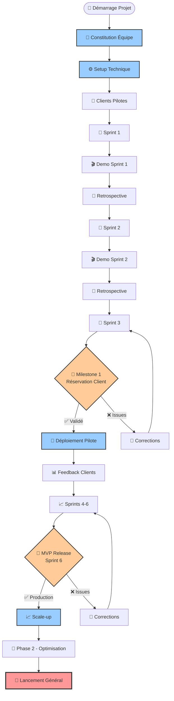
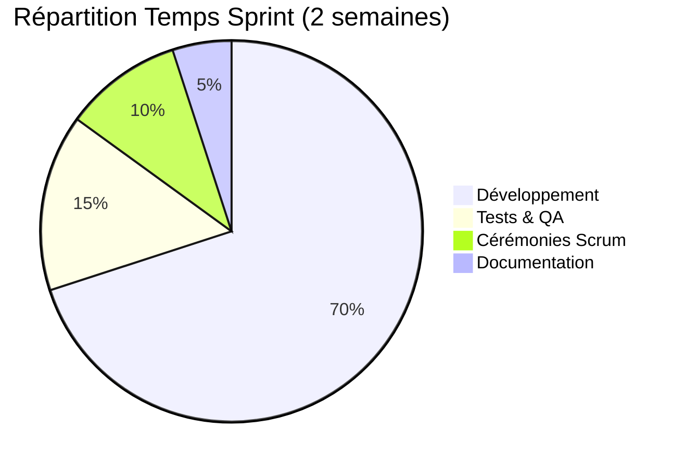
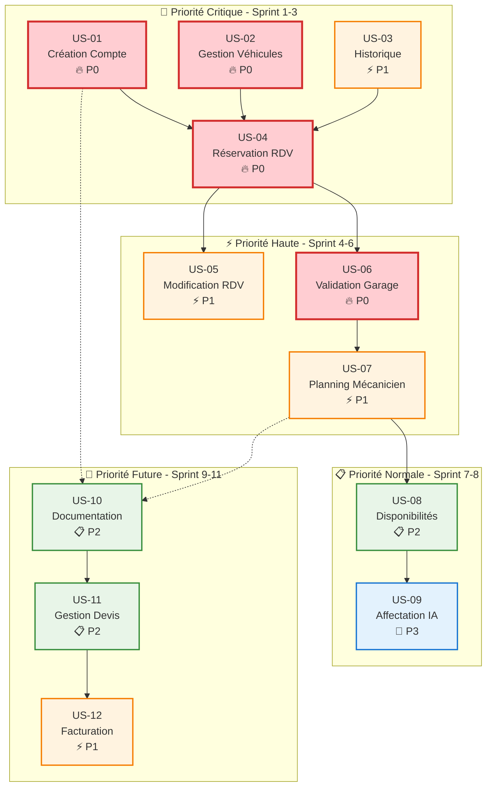
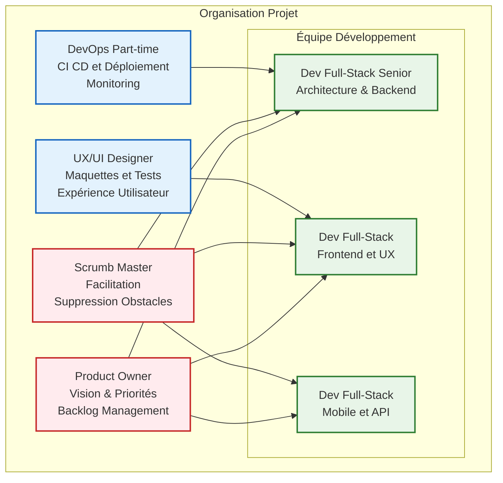
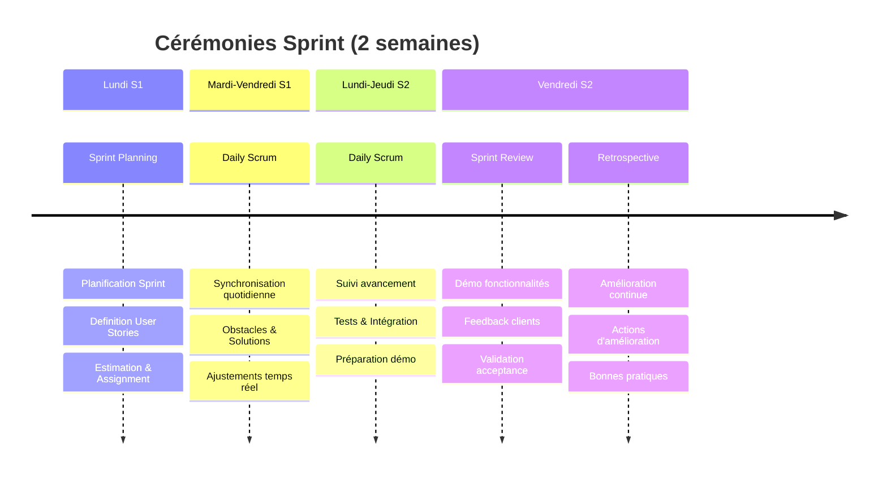
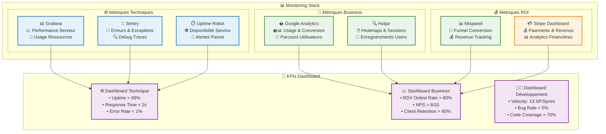
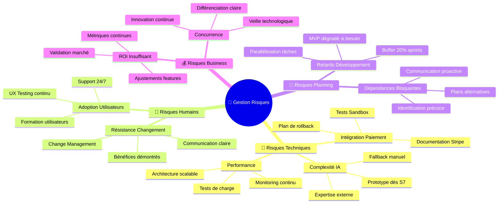
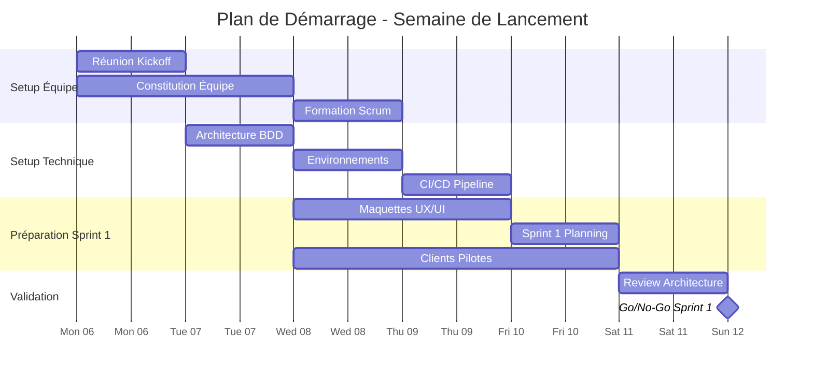
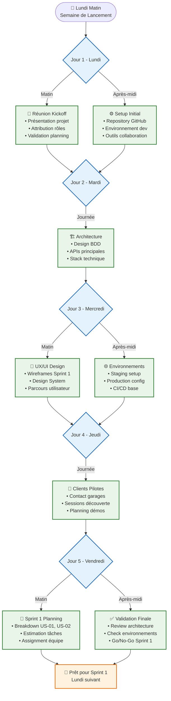

# 🏗️ Guide d'Organisation & Séquencement - My Garage

## 📋 Vue d'ensemble

Ce guide vous accompagne dans l'organisation optimale du projet My Garage pour livrer des fonctionnalités au client le plus rapidement possible de façon itérative.

## 🔗 Liens Essentiels
- **[📅 Planning Stratégique](./PLANNING-STRATEGIQUE.md)** - Planning détaillé et milestones
- **[📋 Issues GitHub](https://github.com/tgrall/my-garage/issues)** - Épics et User Stories
- **[🎯 Documentation Épics](./epics/index.md)** - Spécifications fonctionnelles

---

## 🚀 **Phase 0 : Préparation** (1 semaine)

### **Jour 1-2 : Setup Technique**
```bash
✅ Actions immédiates :
1. Configurer environnements (dev/staging/prod)
2. Setup CI/CD pipeline
3. Choisir et configurer stack technique
4. Créer architecture de base de données
```

**Technologies recommandées** :
- **Frontend** : React + TypeScript + Vite
- **Backend** : Node.js + Express + TypeScript  
- **Base de données** : PostgreSQL
- **Cloud** : AWS/Azure (selon préférence)
- **Monitoring** : Sentry + CloudWatch

### **Jour 3-4 : Équipe & Processus**
```bash
✅ Constitution équipe :
1. Product Owner (PO)
2. Scrum Master (SM) 
3. 2-3 Développeurs Full-Stack
4. 1 UX/UI Designer
5. 1 DevOps (part-time)
```

**Processus Scrum** :
- **Sprints** : 2 semaines
- **Daily** : 15min à 9h00
- **Sprint Review** : 1h le vendredi
- **Retrospective** : 30min après review
- **Planning** : 2h le lundi suivant

### **Jour 5 : Clients Pilotes**
```bash
✅ Identification clients :
1. Contacter 2-3 garages partenaires
2. Planifier sessions de découverte
3. Valider besoins prioritaires
4. Programmer démos régulières
```

---

## 📈 **Stratégie de Livraison Progressive**

### 🎯 **Flow de Développement Agile**



### 🔄 **Cycle de Sprint Optimisé**

```mermaid
gantt
    title Sprint Type - Répartition sur 2 Semaines
    dateFormat  X
    axisFormat %s
    
    section Semaine 1
    Sprint Planning    :planning, 0, 1d
    Développement US 1 :dev1, after planning, 3d
    Daily Scrum       :daily1, 0, 5d
    Développement US 2 :dev2, after dev1, 1d
    
    section Semaine 2
    Développement US 2 :dev2-2, 5, 2d
    Tests & QA        :test, after dev2-2, 2d
    Sprint Review     :review, after test, 1d
    Retrospective     :retro, after review, 1d
```





### **🎯 Principe : "Valeur Client Maximale, Risque Minimal"**

#### **1. Séquencement par Valeur**
```
Priorité 1 : Réservation client (US-01, US-02, US-04)
→ Valeur immédiate : Réduction appels téléphoniques

Priorité 2 : Validation garage (US-06)  
→ Valeur opérationnelle : Contrôle planning

Priorité 3 : Optimisation (US-09)
→ Valeur d'efficacité : Automatisation intelligente
```

#### **2. Dépendances Techniques et Priorités**



---

## 🎯 **Phases de Livraison Détaillées**

### **🥇 PHASE 1 : MVP Foundation** (6 sprints - 3 mois)

#### **Sprint 1** : "Hello World Client" 
**Objectif** : Premiers clients peuvent s'inscrire et gérer leurs véhicules

```bash
🎯 User Stories :
• [US-01: Création compte](https://github.com/tgrall/my-garage/issues/5) (8 SP)
• [US-02: Gestion véhicules](https://github.com/tgrall/my-garage/issues/6) (5 SP)

🔧 Tâches techniques prioritaires :
• Authentification sécurisée (OAuth2 + JWT)
• Base de données clients/véhicules
• Interface responsive inscription/connexion
• API REST de base (users, vehicles)

📦 Livrable Sprint 1 :
• Application web accessible
• Inscription client fonctionnelle  
• Ajout/modification véhicules
• Tests automatisés (>70% couverture)

🧪 Tests d'acceptation :
• Client peut créer un compte
• Client peut ajouter 3 véhicules
• Données persistées en BDD
• Interface responsive mobile/desktop
```

#### **Sprint 2** : "Historique & Préparation RDV"
**Objectif** : Compléter expérience client et préparer réservation

```bash
🎯 User Stories :
• [US-03: Consultation historique](https://github.com/tgrall/my-garage/issues/7) (8 SP)
• Architecture RDV (5 SP - spike technique)

🔧 Focus technique :
• Interface historique interventions
• Modélisation RDV (BDD + API)
• Calcul créneaux disponibles (algorithme base)
• Notifications email/SMS (SendGrid/Twilio)

📦 Livrable Sprint 2 :
• Historique interventions par véhicule
• Fondations techniques pour RDV
• Système de notifications opérationnel

🧪 Tests d'acceptation :
• Client voit historique de ses véhicules
• Notifications email fonctionnelles
• API RDV prête pour Sprint 3
```

#### **Sprint 3** : "🎯 MILESTONE 1 - Réservation Client"
**Objectif** : Premier vrai value-delivery au client

```bash
🎯 User Stories :
• [US-04: Prise de RDV en ligne](https://github.com/tgrall/my-garage/issues/8) (13 SP)

🔧 Complexité maximale :
• Algorithme créneaux disponibles temps réel
• Interface calendrier intuitive
• Calcul automatique durée/prix
• Pre-réservation avec workflow validation

📦 Livrable Sprint 3 - DÉMO CLIENT :
• 🚀 PREMIÈRE DEMO CLIENT PILOTE
• Client peut réserver RDV 24/7
• Estimation prix/durée automatique
• Email confirmation automatique

🎉 Success Metrics :
• Temps prise RDV < 5 minutes
• 0 bug critique en production
• Feedback client > 7/10
```

#### **Sprints 4-6** : Completion MVP
- **Sprint 4** : Modification RDV + début validation garage
- **Sprint 5** : Interface garage complète  
- **Sprint 6** : **🚀 MVP RELEASE** - Premier déploiement client

---

### **🥈 PHASE 2 : Optimisation** (5 sprints - 2,5 mois)

#### **Sprint 7-8** : Intelligence Artificielle
- Affectation automatique optimale
- Interface mobile mécaniciens

#### **Sprint 9-11** : Cycle Commercial  
- Documentation intervention complète
- Devis/facturation automatisés
- **🎯 LANCEMENT GÉNÉRAL**

---

## � **Organisation de l'Équipe**

### 👥 **Structure Équipe Recommandée**



### 📅 **Cérémonies Scrum Optimisées**



## �🔄 **Méthodologie de Travail Recommandée**

### **Daily Scrum Optimisé**
```bash
Template daily (max 15 min) :
👤 [Prénom] :
  ✅ Hier : [Tâche terminée]
  🎯 Aujourd'hui : [Objectif principal]  
  🚨 Blockers : [Problème urgent ou RAS]
  
📊 Burndown : [SM] mise à jour rapide
🔄 Ajustements : [PO] si nécessaires
```

### **Sprint Review Structure**
```bash
📅 Sprint Review (60 minutes) :
1. Démo fonctionnalités (30 min)
   → Sur environnement staging
   → Parcours utilisateur complet
   
2. Feedback clients pilotes (20 min)
   → Retours d'usage réel
   → Priorités ajustées si nécessaire
   
3. Métriques & KPIs (10 min)
   → Performance technique
   → Adoption utilisateurs
```

### **Gestion des Priorités**
```bash
🔥 Priorité P0 - CRITIQUE :
• Bugs bloquants production
• Sécurité/données clients
• Fonctionnalités MVP essentielles

⚡ Priorité P1 - HAUTE :
• User Stories sprint en cours
• Optimisations performance majeures
• Feedback client urgent

📋 Priorité P2 - NORMALE :
• User Stories sprint suivant
• Tech debt raisonnable
• Améliorations UX

🔮 Priorité P3 - FUTURE :
• Nice-to-have
• Recherche & innovation
• Optimisations avancées
```

---

## 📊 **Indicateurs de Succès & Monitoring**

### **KPIs par Phase**

#### **Phase 1 - MVP** (Sprint 1-6)
```bash
🎯 Metrics Sprint 1-3 :
• Vitesse équipe : 13 SP/sprint stable
• Bug rate : <5% des user stories
• Test coverage : >70%
• Client satisfaction : >7/10

🎯 Metrics Sprint 4-6 :
• Temps prise RDV : <3 minutes
• Uptime : >99%
• Performance : <2s chargement
• Adoption : 50% RDV en ligne (vs téléphone)
```

#### **Phase 2 - Optimisation** (Sprint 7-11)
```bash
🎯 Metrics avancées :
• Taux occupation mécaniciens : +15%
• Temps administratif : -40%
• NPS client : >8/10
• ROI garage : >150%
```

### **Dashboard Monitoring**



### 📊 **Outils Recommandés par Catégorie**

```bash
📊 Business Intelligence :
• Google Analytics : Usage & conversion
• Hotjar : Comportement utilisateur  
• Mixpanel : Funnel & retention

⚙️ Monitoring Technique :
• Grafana : Métriques serveur
• Sentry : Erreurs & debugging
• Uptime Robot : Disponibilité

💰 Métriques Financières :
• Stripe Dashboard : Paiements
• Custom Analytics : ROI garage
```

---

## 🚨 **Gestion des Risques & Contingence**

### **Plan de Mitigation des Risques**



### **Risques Identifiés & Actions**

#### **Risque Technique** : Complexité algorithme affectation (US-09)
```bash
🎯 Probabilité : Haute
🔥 Impact : Critique pour optimisation

💡 Plan d'atténuation :
• Prototype algorithme dès Sprint 7
• Fallback : affectation manuelle intelligente
• Expertise externe si besoin (consultant IA)
• Tests A/B algorithme vs manuel
```

#### **Risque Adoption** : Résistance utilisateurs
```bash
🎯 Probabilité : Moyenne  
🔥 Impact : Critique pour ROI

💡 Plan d'atténuation :
• UX testing dès Sprint 2
• Formation utilisateurs progressive
• Support 24/7 pendant déploiement
• Interface intuitive (inspiration Doctolib)
```

#### **Risque Planning** : Sous-estimation complexité
```bash
🎯 Probabilité : Moyenne
🔥 Impact : Retard livraison

💡 Plan d'atténuation :
• Buffer 20% dans chaque sprint
• Re-estimation continue
• Scope ajustable par milestone
• MVP dégradé si nécessaire
```

---

## ✅ **Checklist de Démarrage Projet**

### **Semaine -1 (Préparation)**
- [ ] **Équipe constituée** et formée Scrum
- [ ] **Stack technique** validée et installée
- [ ] **Environnements** configurés (dev/staging/prod)
- [ ] **Repository GitHub** organisé avec issues
- [ ] **Clients pilotes** identifiés et contactés

### **Sprint 1 - Jour 1**
- [ ] **Sprint Planning** réalisé (US-01, US-02)
- [ ] **Definition of Done** définie équipe
- [ ] **Architecture technique** détaillée
- [ ] **Maquettes UX/UI** validées Sprint 1
- [ ] **Tests automatisés** configurés

### **Sprint 1 - Jour 14**
- [ ] **Demo client** Sprint 1 réussie
- [ ] **Retrospective** avec actions concrètes
- [ ] **Sprint 2** planifié et prêt
- [ ] **Métriques** collectées et analysées
- [ ] **Feedback client** intégré backlog

---

## 🎯 **Actions Immédiates - Cette Semaine**

### 🚀 **Roadmap de Démarrage (7 jours)**



### 📋 **Checklist Jour par Jour**



### **Lundi**
1. **Réunion kickoff** projet (2h)
   - Présentation planning stratégique
   - Attribution des rôles équipe
   - Validation approche itérative

2. **Setup technique** (reste de la journée)
   - Environnement développement
   - Repository structure
   - CI/CD de base

### **Mardi-Mercredi**
1. **Architecture détaillée** (1 jour)
   - Base de données complète
   - APIs principales
   - Sécurité et authentification

2. **Maquettes UX/UI** (1 jour)
   - Wireframes Sprint 1
   - Design system de base
   - Parcours utilisateur prioritaires

### **Jeudi-Vendredi**
1. **Sprint 1 Planning** (demi-journée)
   - Breakdown US-01 et US-02 en tâches
   - Estimation détaillée
   - Assignment développeurs

2. **Préparation démarrage** (reste du temps)
   - Configuration outils équipe
   - Premier contact clients pilotes
   - Setup monitoring de base

---

## 🎉 **Conclusion**

Ce guide vous donne toutes les clés pour :

✅ **Démarrer rapidement** avec les bonnes fondations
✅ **Livrer de la valeur** dès le Sprint 3 
✅ **Itérer efficacement** avec feedback client continu
✅ **Minimiser les risques** par une approche progressive
✅ **Atteindre le succès** avec un MVP robuste et une version finale optimisée

**La clé du succès** : Restez focus sur la valeur client, maintenez un rythme soutenable, et ajustez selon les retours d'expérience.

---

*Guide vivant - à mettre à jour selon l'évolution du projet et les apprentissages de l'équipe.*