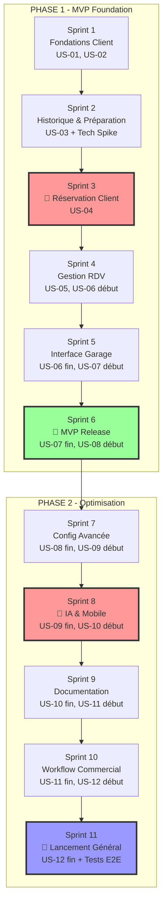
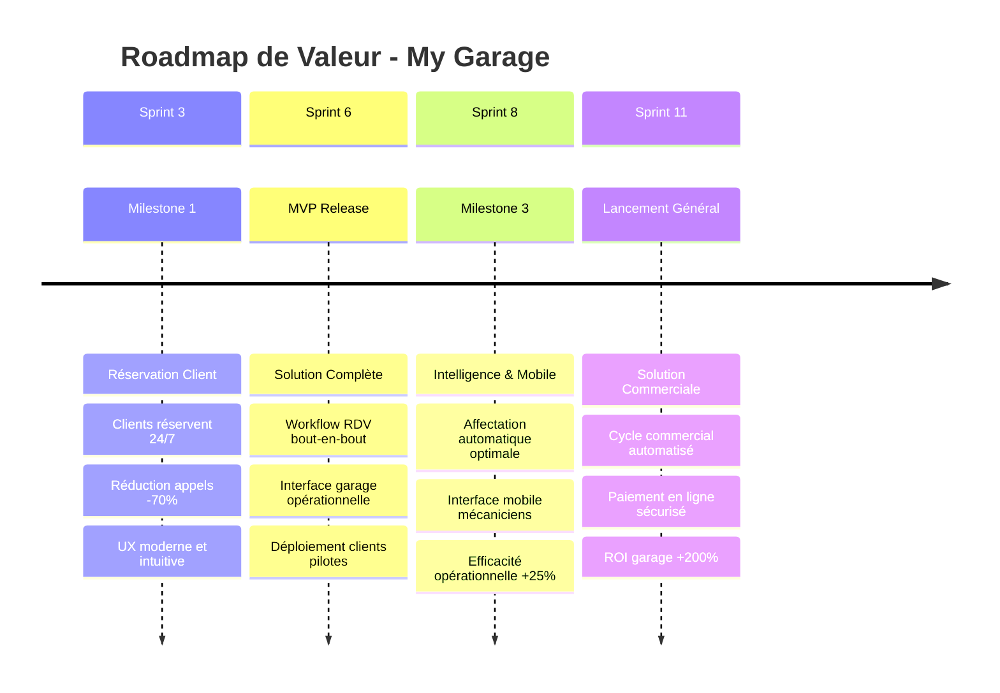
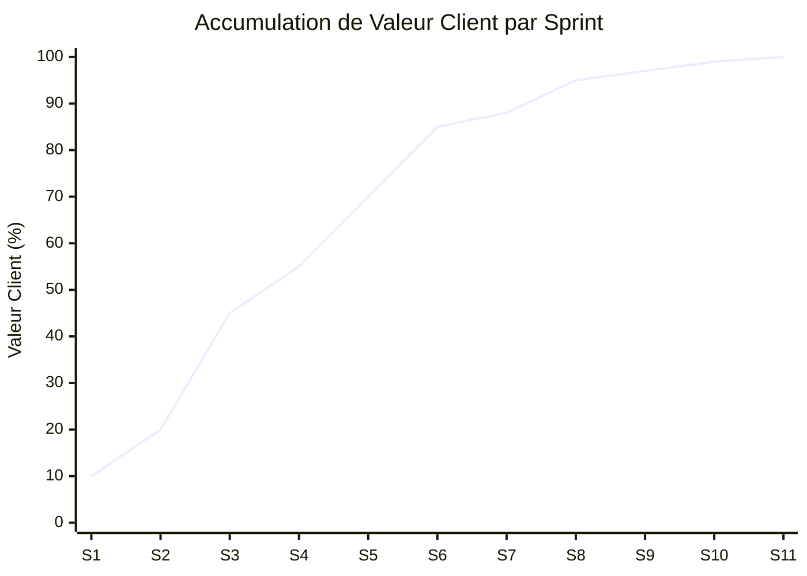
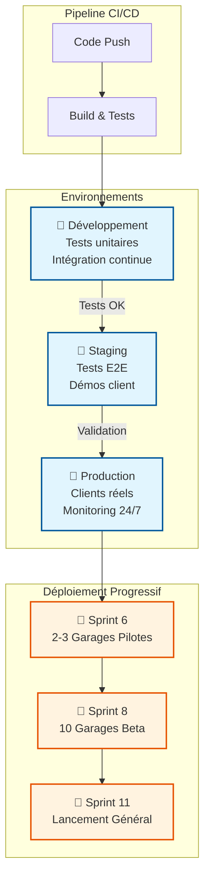
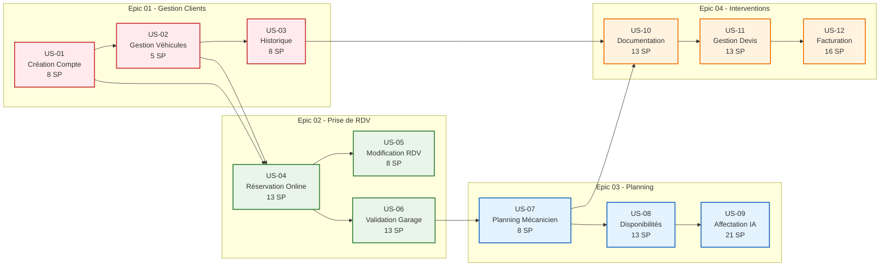
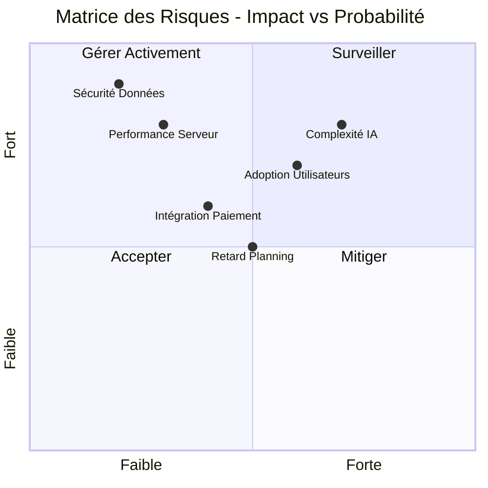

# 📅 Planning & Stratégie de Livraison - My Garage

## 🎯 Vue d'ensemble du Planning

### 📊 Résumé Exécutif
- **Durée totale estimée** : 11 sprints (5,5 mois)
- **MVP** : Sprint 6 (3 mois)
- **Version complète** : Sprint 11 (5,5 mois)
- **Approche** : Développement itératif avec livraisons continues

## 🔗 Liens GitHub Issues
- **[Epic 01 - Gestion Clients](https://github.com/tgrall/my-garage/issues/1)** (#1)
- **[Epic 02 - Prise de RDV](https://github.com/tgrall/my-garage/issues/2)** (#2)
- **[Epic 03 - Planning](https://github.com/tgrall/my-garage/issues/3)** (#3)
- **[Epic 04 - Interventions](https://github.com/tgrall/my-garage/issues/4)** (#4)

## � Vue d'ensemble du Planning

```mermaid
gantt
    title Planning Stratégique My Garage - 11 Sprints
    dateFormat  X
    axisFormat %s
    
    section Phase 1 - MVP
    Sprint 1 - Fondations Client     :s1, 0, 2w
    Sprint 2 - Historique & Préparation :s2, after s1, 2w
    Sprint 3 - Réservation Client    :milestone, m1, after s2, 0
    Sprint 4 - Gestion RDV          :s4, after s2, 2w
    Sprint 5 - Interface Garage     :s5, after s4, 2w
    Sprint 6 - MVP Release          :milestone, mvp, after s5, 0
    
    section Phase 2 - Optimisation
    Sprint 7 - Config Avancée       :s7, after s5, 2w
    Sprint 8 - IA & Mobile          :milestone, m3, after s7, 0
    Sprint 9 - Documentation        :s9, after s7, 2w
    Sprint 10 - Workflow Commercial :s10, after s9, 2w
    Sprint 11 - Lancement Général   :milestone, final, after s10, 0
```



## 🔄 Flux des Dépendances



## �📋 Planning Détaillé

### 🏁 **PHASE 1 : MVP Foundation** (Sprints 1-6)

#### **Sprint 1** (2 semaines) - Fondations Client
- **[US-01: Création compte client](https://github.com/tgrall/my-garage/issues/5)** (8 SP)
- **[US-02: Gestion véhicules](https://github.com/tgrall/my-garage/issues/6)** (5 SP)
- **Total**: 13 Story Points
- **Objectif**: Base utilisateur fonctionnelle
- **Livrable**: Inscription, connexion, profil client, ajout véhicules

#### **Sprint 2** (2 semaines) - Historique & RDV Base
- **[US-03: Consultation historique](https://github.com/tgrall/my-garage/issues/7)** (8 SP)
- Architecture RDV (5 SP - tech spike)
- **Total**: 13 Story Points
- **Objectif**: Compléter gestion client + préparation RDV
- **Livrable**: Historique interventions, architecture RDV

#### **Sprint 3** (2 semaines) - Prise de RDV Core
- **[US-04: Prise de RDV en ligne](https://github.com/tgrall/my-garage/issues/8)** (13 SP)
- **Total**: 13 Story Points
- **Objectif**: Réservation en ligne fonctionnelle
- **Livrable**: Système de réservation client
- **🎯 MILESTONE**: Clients peuvent réserver en ligne

#### **Sprint 4** (2 semaines) - Gestion RDV & Planning Base
- **[US-05: Modification/Annulation RDV](https://github.com/tgrall/my-garage/issues/9)** (8 SP)
- **[US-06: Validation RDV garage](https://github.com/tgrall/my-garage/issues/10)** (13 SP) - Début
- **Total**: 13 Story Points (US-06 continue sur Sprint 5)
- **Objectif**: Gestion complète RDV côté client
- **Livrable**: Modification/annulation + début validation garage

#### **Sprint 5** (2 semaines) - Planning Garage
- **[US-06: Validation RDV garage](https://github.com/tgrall/my-garage/issues/10)** (Fin - 8 SP restants)
- **[US-07: Visualisation planning](https://github.com/tgrall/my-garage/issues/11)** (8 SP) - Début
- **Total**: 13 Story Points
- **Objectif**: Interface garage opérationnelle
- **Livrable**: Dashboard validation RDV, début planning mécanicien

#### **Sprint 6** (2 semaines) - MVP Final
- **[US-07: Visualisation planning](https://github.com/tgrall/my-garage/issues/11)** (Fin - 5 SP restants)
- **[US-08: Gestion disponibilités](https://github.com/tgrall/my-garage/issues/12)** (8 SP) - Début
- **Total**: 13 Story Points
- **🎯 MVP RELEASE**: Version déployable pour premiers clients
- **Livrable**: Application complète MVP

---

### 🚀 **PHASE 2 : Optimisation & Enrichissement** (Sprints 7-11)

#### **Sprint 7** (2 semaines) - Optimisation Planning
- **[US-08: Gestion disponibilités](https://github.com/tgrall/my-garage/issues/12)** (Fin - 5 SP restants)
- **[US-09: Affectation intelligente](https://github.com/tgrall/my-garage/issues/13)** (13 SP) - Début
- **Total**: 13 Story Points
- **Objectif**: Intelligence artificielle planning
- **Livrable**: Configuration avancée + début IA

#### **Sprint 8** (2 semaines) - IA Planning & Doc Interventions
- **[US-09: Affectation intelligente](https://github.com/tgrall/my-garage/issues/13)** (Fin - 8 SP restants)
- **[US-10: Documentation intervention](https://github.com/tgrall/my-garage/issues/14)** (13 SP) - Début
- **Total**: 13 Story Points
- **Objectif**: Algorithmes optimisation + documentation mobile
- **Livrable**: IA affectation + interface mobile intervention

#### **Sprint 9** (2 semaines) - Interventions Core
- **[US-10: Documentation intervention](https://github.com/tgrall/my-garage/issues/14)** (Fin - 8 SP restants)
- **[US-11: Gestion devis](https://github.com/tgrall/my-garage/issues/15)** (8 SP) - Début
- **Total**: 13 Story Points
- **Objectif**: Cycle intervention complet
- **Livrable**: Documentation complète + génération devis

#### **Sprint 10** (2 semaines) - Devis & Facturation
- **[US-11: Gestion devis](https://github.com/tgrall/my-garage/issues/15)** (Fin - 5 SP restants)
- **[US-12: Facturation paiement](https://github.com/tgrall/my-garage/issues/16)** (13 SP) - Début
- **Total**: 13 Story Points
- **Objectif**: Workflow commercial complet
- **Livrable**: Devis + début facturation

#### **Sprint 11** (2 semaines) - Version Finale
- **[US-12: Facturation paiement](https://github.com/tgrall/my-garage/issues/16)** (Fin - 3 SP restants)
- Tests E2E, Optimisations, Documentation (10 SP)
- **Total**: 13 Story Points
- **🎯 FINAL RELEASE**: Version production complète

## 📈 Stratégie de Livraison Itérative

### 🎯 **Roadmap de Valeur Client**



### 📊 **Evolution de la Valeur par Sprint**



### 🎯 **Milestones de Valeur Client**

#### **Milestone 1** (Fin Sprint 3) : "Réservation Client"
```
✅ Fonctionnalités livrées :
• Création compte client
• Gestion véhicules
• Prise de RDV en ligne
• Historique de base

🎯 Valeur client :
• Réservation 24/7 sans appel téléphonique
• Gestion autonome du profil
```

#### **Milestone 2** (Fin Sprint 6) : "MVP Complet"
```
✅ Fonctionnalités livrées :
• Gestion complète des RDV client
• Interface garage pour validation
• Planning mécanicien de base
• Workflow complet de réservation

🎯 Valeur client :
• Solution complète de gestion RDV
• Optimisation première du planning garage
• Réduction charge administrative
```

#### **Milestone 3** (Fin Sprint 8) : "Intelligence & Mobile"
```
✅ Fonctionnalités livrées :
• Affectation intelligente des RDV
• Interface mobile pour mécaniciens
• Documentation intervention temps réel

🎯 Valeur client :
• Optimisation automatique des ressources
• Traçabilité complète des interventions
• Efficacité opérationnelle maximisée
```

#### **Milestone 4** (Fin Sprint 11) : "Solution Commerciale Complète"
```
✅ Fonctionnalités livrées :
• Cycle commercial complet (devis/facturation)
• Paiement en ligne sécurisé
• Export comptable automatisé

🎯 Valeur client :
• Digitalisation complète du processus
• Encaissement optimisé
• Conformité comptable automatique
```

## 🔄 **Séquence de Mise en Œuvre Recommandée**

### **Phase Préparatoire** (1 semaine avant Sprint 1)
1. **Setup environnement développement**
   - Repository GitHub configuré ✅
   - CI/CD pipeline
   - Environnements (dev, staging, prod)

2. **Architecture technique**
   - Stack technique validée
   - Base de données conçue
   - APIs principales définies

3. **Équipe & Méthodologie**
   - Équipe constituée
   - Cérémonies Scrum définies
   - Outils de collaboration configurés

### **Déploiement Progressif**

#### **Semaine 1-2** (Sprint 1)
- **Focus**: Fondations robustes
- **Risques**: Architecture, sécurité
- **Tests**: Authentification, RGPD

#### **Semaine 7-8** (Sprint 4) 
- **Focus**: Tests utilisateurs MVP partiel
- **Feedback**: Premiers retours clients sur UX
- **Ajustements**: Interface et workflow

#### **Semaine 11-12** (Sprint 6)
- **🚀 DÉPLOIEMENT MVP**
- **Clients pilotes**: 2-3 garages partenaires
- **Monitoring**: Métriques usage et performance
- **Support**: Assistance déploiement 24/7

#### **Semaine 15-16** (Sprint 8)
- **Déploiement progressif**: Extension à 10 garages
- **Formation**: Sessions utilisateurs avancées
- **Optimisation**: Basée sur données réelles

#### **Semaine 21-22** (Sprint 11)
- **🎯 LANCEMENT GÉNÉRAL**
- **Marketing**: Campagne de lancement
- **Scale-up**: Infrastructure production
- **Support**: Documentation complète

## 📊 **Métriques de Succès**

### **KPIs MVP** (Sprint 6)
- **Adoption**: 80% des RDV pris en ligne
- **Performance**: Temps prise RDV < 3 minutes
- **Satisfaction**: NPS > 7/10
- **Technique**: Uptime > 99%

### **KPIs Version Finale** (Sprint 11)
- **Business**: Réduction 50% temps administratif
- **Client**: Délai confirmation RDV < 2h
- **Optimisation**: Taux occupation mécaniciens +20%
- **Financier**: ROI déploiement > 200%

## 🏗️ **Architecture de Déploiement**



## 🔄 **Flux de Développement des User Stories**



## 🚨 **Gestion des Risques**

### 📊 **Matrice des Risques**



### **Risques Techniques**
- **Complexité algorithme affectation** (US-09)
  - *Mitigation*: Prototype dès Sprint 7, fallback manuel
- **Intégration paiement** (US-12)
  - *Mitigation*: Tests Stripe sandbox dès Sprint 10

### **Risques Métier**
- **Adoption utilisateurs**
  - *Mitigation*: UX testing continu, formation utilisateurs
- **Charge serveur**
  - *Mitigation*: Tests de charge, architecture scalable

### **Risques Planning**
- **Dépendances épics**
  - *Mitigation*: Parallélisation possible, MVP dégradé
- **Complexité sous-estimée**
  - *Mitigation*: Buffer 20% dans chaque sprint

## 🔧 **Recommandations de Mise en Œuvre**

### **1. Démarrage Optimal**
```bash
# Priorités absolues Sprint 1
1. Architecture sécurisée (authentification OAuth2)
2. Base de données bien conçue (extensibilité)
3. API RESTful documentée (OpenAPI)
4. Tests automatisés dès le début
```

### **2. Validation Continue**
- **Démos client** à chaque fin de sprint
- **Tests utilisabilité** dès Sprint 3
- **Feedback loop** serré avec garages pilotes

### **3. Qualité & Performance**
- **Code review** obligatoire
- **Tests automatisés** (70% couverture minimum)
- **Monitoring** temps réel dès MVP

### **4. Documentation Vivante**
- **README technique** maintenu
- **Documentation API** auto-générée
- **Guide utilisateur** itératif

---

## 🎯 **Actions Immédiates**

### **Semaine Prochaine**
1. **Constituer l'équipe** (Dev, PO, SM, UX/UI)
2. **Valider la stack technique** (React/Node.js/PostgreSQL?)
3. **Configurer l'environnement** (AWS/Azure/GCP?)
4. **Planifier Sprint 1** (backlog refinement)

### **Ce Mois**
1. **Lancer Sprint 1** avec US-01 et US-02
2. **Identifier garages pilotes** pour tests
3. **Valider maquettes UX/UI** principales
4. **Mettre en place métriques** de suivi

---

*Ce planning est évolutif et sera ajusté selon les retours d'expérience et les contraintes rencontrées. L'objectif est de maximiser la valeur livrée à chaque itération.*