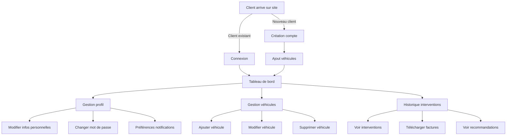

# EPIC 1: Gestion des Clients 👤

## 🔗 Navigation Rapide
- **[📋 Index Général](../../index.md)** | **[📚 Documentation](../index.md)** | **[🎯 Épics](./index.md)**
- **Épics :** [Epic 02 - RDV](./EPIC-02-prise-rdv.md) | [Epic 03 - Planning](./EPIC-03-planning.md) | [Epic 04 - Interventions](./EPIC-04-interventions.md)

## Vue d'ensemble

Cette epic couvre toutes les fonctionnalités liées à la gestion des comptes clients, leurs véhicules et leur historique d'interventions.

## 📋 User Stories de cette Epic
- **[US-01](#us-01-création-de-compte-client)** - Création de compte client
- **[US-02](#us-02-gestion-des-véhicules)** - Gestion des véhicules  
- **[US-03](#us-03-consultation-historique)** - Consultation historique

## Diagramme de flux



## User Stories détaillées

### US-01: Création de compte client

**En tant que** nouveau client  
**Je veux** créer mon compte sur la plateforme  
**Afin de** pouvoir prendre des rendez-vous en ligne

#### Critères d'acceptation détaillés

1. **Formulaire d'inscription**
   - Email unique et valide (vérification format)
   - Mot de passe fort (min 8 caractères, 1 majuscule, 1 minuscule, 1 chiffre, 1 caractère spécial)
   - Confirmation mot de passe
   - Acceptation CGU obligatoire
   - Captcha anti-bot

2. **Champs obligatoires**
   - Civilité (M./Mme)
   - Nom (2-50 caractères)
   - Prénom (2-50 caractères)
   - Email
   - Téléphone mobile (format FR: 06/07)
   - Code postal
   - Ville

3. **Champs optionnels**
   - Téléphone fixe
   - Adresse complète
   - Date de naissance
   - Entreprise (si professionnel)
   - N° SIRET (si professionnel)

4. **Processus de validation**
   - Email de confirmation envoyé
   - Lien valide 24h
   - Compte activé après validation

#### Exemple de données

```json
{
  "civilite": "M.",
  "nom": "DUPONT",
  "prenom": "Jean",
  "email": "jean.dupont@email.fr",
  "telephone_mobile": "0612345678",
  "telephone_fixe": "0145678901",
  "adresse": {
    "numero": "15",
    "rue": "Rue de la République",
    "code_postal": "75001",
    "ville": "Paris"
  },
  "date_naissance": "1985-03-15",
  "type_client": "particulier",
  "preferences": {
    "rappel_sms": true,
    "rappel_email": true,
    "newsletter": false
  },
  "date_creation": "2024-01-15T10:30:00Z",
  "statut": "actif"
}
```

### US-02: Gestion des véhicules

**En tant que** client inscrit  
**Je veux** gérer mes véhicules dans mon espace  
**Afin de** les associer facilement à mes rendez-vous

#### Critères d'acceptation détaillés

1. **Ajout de véhicule**
   - Maximum 5 véhicules par compte particulier
   - Maximum 20 véhicules par compte professionnel
   - Import possible via immatriculation (API SIV)
   
2. **Informations véhicule**
   - **Obligatoires:**
     - Immatriculation (format AA-123-AA ou 1234-AA-56)
     - Marque
     - Modèle
     - Année (1900-année en cours +1)
     - Type carburant
     - Kilométrage actuel
   - **Optionnelles:**
     - N° série (VIN)
     - Date 1ère mise en circulation
     - Date achat
     - Couleur
     - Puissance fiscale
     - Photo du véhicule

3. **Fonctionnalités**
   - Définir un véhicule principal
   - Archiver un véhicule vendu
   - Historique kilométrage
   - Alertes entretien

#### Exemples de véhicules

```json
[
  {
    "id": "VEH-2024-001",
    "immatriculation": "AB-123-CD",
    "marque": "Renault",
    "modele": "Clio V",
    "annee": 2020,
    "vin": "VF1RJA00064512345",
    "carburant": "Essence",
    "kilometrage_actuel": 45000,
    "date_mise_circulation": "2020-06-15",
    "couleur": "Blanc glacier",
    "puissance_fiscale": 5,
    "principal": true,
    "alertes": {
      "vidange": {
        "km_prochain": 50000,
        "date_prochain": "2024-06-15"
      },
      "controle_technique": {
        "date_prochain": "2024-06-15"
      }
    }
  },
  {
    "id": "VEH-2024-002",
    "immatriculation": "EF-456-GH",
    "marque": "Peugeot",
    "modele": "3008",
    "annee": 2018,
    "vin": "VF3MCBHZJJS123456",
    "carburant": "Diesel",
    "kilometrage_actuel": 120000,
    "date_mise_circulation": "2018-03-20",
    "couleur": "Gris artense",
    "puissance_fiscale": 7,
    "principal": false
  }
]
```

### US-03: Consultation historique

**En tant que** client  
**Je veux** consulter l'historique de mes interventions  
**Afin de** suivre l'entretien de mes véhicules

#### Critères d'acceptation détaillés

1. **Affichage historique**
   - Vue chronologique (plus récent en premier)
   - Filtres: véhicule, période, type intervention, montant
   - Recherche par mots-clés
   - Pagination (20 résultats/page)

2. **Détails intervention**
   - Date et heure
   - Véhicule concerné
   - Kilométrage lors intervention
   - Type intervention
   - Opérations réalisées
   - Pièces changées
   - Mécanicien responsable
   - Montant TTC
   - Statut paiement
   - Garantie applicable

3. **Documents associés**
   - Facture PDF
   - Devis signé
   - Photos avant/après
   - Rapport contrôle technique
   - Bon de garantie

#### Exemple d'historique

```json
{
  "interventions": [
    {
      "id": "INT-2024-0156",
      "date": "2024-01-10T09:00:00Z",
      "vehicule": "AB-123-CD",
      "kilometrage": 44500,
      "type": "Révision complète",
      "operations": [
        {
          "libelle": "Vidange moteur",
          "duree_minutes": 30,
          "prix_mo": 35.00
        },
        {
          "libelle": "Remplacement filtre à huile",
          "duree_minutes": 10,
          "prix_mo": 11.67
        },
        {
          "libelle": "Remplacement filtre à air",
          "duree_minutes": 15,
          "prix_mo": 17.50
        }
      ],
      "pieces": [
        {
          "reference": "HU-719/6",
          "libelle": "Filtre à huile MANN",
          "quantite": 1,
          "prix_unitaire": 12.50
        },
        {
          "reference": "5W30-5L",
          "libelle": "Huile moteur 5W30 5L",
          "quantite": 1,
          "prix_unitaire": 45.00
        }
      ],
      "mecanicien": "Pierre MARTIN",
      "montant": {
        "total_mo": 64.17,
        "total_pieces": 57.50,
        "total_ht": 121.67,
        "tva": 24.33,
        "total_ttc": 146.00
      },
      "statut_paiement": "Payé",
      "mode_paiement": "CB",
      "garantie_jusqu_au": "2025-01-10",
      "documents": [
        {
          "type": "facture",
          "url": "/documents/FAC-2024-0156.pdf"
        }
      ],
      "recommandations": [
        "Prévoir changement plaquettes avant dans 10 000 km",
        "Contrôle technique à effectuer avant le 15/06/2024"
      ]
    }
  ],
  "total_interventions": 15,
  "page": 1,
  "par_page": 20
}
```

## Règles métier spécifiques

- **RG-CLIENT-01**: Un email ne peut être associé qu'à un seul compte
- **RG-CLIENT-02**: Suppression automatique des comptes inactifs après 3 ans (RGPD)
- **RG-CLIENT-03**: Maximum 5 véhicules pour un particulier, 20 pour un professionnel
- **RG-CLIENT-04**: L'historique est conservé 10 ans pour les interventions de sécurité

---

## 🔗 Navigation

### 📄 Cette Epic
- **[US-01](#us-01-création-de-compte-client)** - Création de compte client
- **[US-02](#us-02-gestion-des-véhicules)** - Gestion des véhicules
- **[US-03](#us-03-consultation-historique)** - Consultation historique

### 🎯 Autres Épics
- **[Epic 02 - Prise de RDV](./EPIC-02-prise-rdv.md)** - Système de réservation
- **[Epic 03 - Planning](./EPIC-03-planning.md)** - Gestion des ressources
- **[Epic 04 - Interventions](./EPIC-04-interventions.md)** - Cycle des interventions

### 📚 Documentation
- **[🎯 Index des Épics](./index.md)** - Vue d'ensemble des épics
- **[📚 Documentation](../index.md)** - Accès à toute la documentation
- **[📐 Règles Métier](../business-rules/BUSINESS-RULES.md)** - Contraintes et règles
- **[🏠 Accueil](../../index.md)** - Vue d'ensemble du projet

*Dernière mise à jour : Octobre 2025*
- **RG-CLIENT-05**: Un client "blacklisté" ne peut pas créer de nouveau compte avec le même email/téléphone

## Métriques de succès

- Taux de conversion visiteur -> compte créé > 30%
- Temps moyen création compte < 3 minutes
- Taux de complétion profil > 80%
- Nombre moyen de véhicules par compte: 1.5
- Taux consultation historique mensuel > 40%