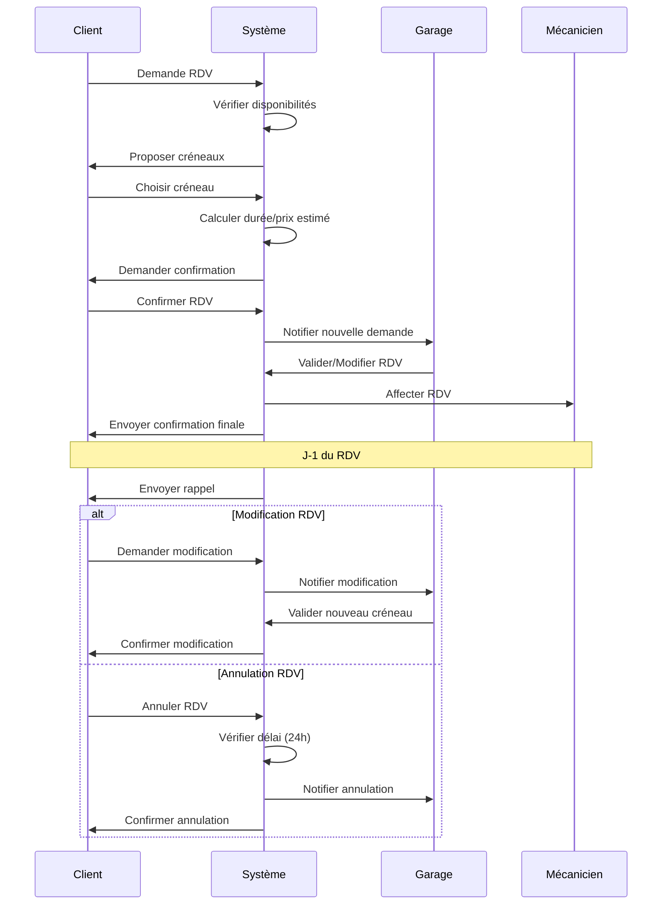

# EPIC 2: Prise de Rendez-vous 📅

## Vue d'ensemble

Cette epic gère tout le processus de prise, modification et annulation de rendez-vous, depuis la demande client jusqu'à la confirmation par le garage.

## Diagramme de flux



## User Stories détaillées

### US-04: Prise de RDV en ligne

**En tant que** client  
**Je veux** prendre un RDV en ligne  
**Afin d'** éviter les appels téléphoniques et gagner du temps

#### Critères d'acceptation détaillés

1. **Étape 1: Sélection du service**
   - Liste des prestations groupées par catégorie
   - Description détaillée de chaque prestation
   - Durée estimée affichée
   - Prix indicatif ou fourchette
   - Possibilité de sélectionner plusieurs prestations

2. **Étape 2: Sélection du véhicule**
   - Liste des véhicules du client
   - Option "Ajouter un nouveau véhicule"
   - Affichage dernière intervention sur ce véhicule

3. **Étape 3: Choix du créneau**
   - Calendrier avec disponibilités sur 30 jours
   - Créneaux par demi-heure
   - Code couleur (vert: disponible, orange: peu de place, rouge: complet)
   - Affichage "Prochain créneau disponible"

4. **Étape 4: Informations complémentaires**
   - Champ commentaire libre (500 caractères)
   - Upload photos (max 5, 10MB/photo)
   - Urgence (oui/non)
   - Besoin véhicule de prêt
   - Dépôt clés en dehors horaires

5. **Étape 5: Confirmation**
   - Récapitulatif complet
   - Estimation prix total
   - CGV à accepter
   - Email + SMS de confirmation

#### Exemples de prestations

```json
{
  "categories": [
    {
      "nom": "Entretien courant",
      "prestations": [
        {
          "code": "PRES-001",
          "libelle": "Vidange simple",
          "description": "Vidange huile moteur + remplacement filtre à huile",
          "duree_minutes": 30,
          "prix_estimatif": {
            "min": 60,
            "max": 90
          },
          "vehicules_eligibles": ["Citadine", "Berline", "SUV"]
        },
        {
          "code": "PRES-002",
          "libelle": "Révision constructeur",
          "description": "Révision complète selon préconisations constructeur",
          "duree_minutes": 120,
          "prix_estimatif": {
            "min": 150,
            "max": 300
          }
        },
        {
          "code": "PRES-003",
          "libelle": "Contrôle technique",
          "description": "Passage au contrôle technique + contre-visite si nécessaire",
          "duree_minutes": 45,
          "prix_fixe": 78
        }
      ]
    },
    {
      "nom": "Freinage",
      "prestations": [
        {
          "code": "PRES-010",
          "libelle": "Changement plaquettes avant",
          "description": "Remplacement plaquettes de frein avant",
          "duree_minutes": 60,
          "prix_estimatif": {
            "min": 80,
            "max": 150
          }
        },
        {
          "code": "PRES-011",
          "libelle": "Changement disques + plaquettes avant",
          "description": "Remplacement complet système freinage avant",
          "duree_minutes": 90,
          "prix_estimatif": {
            "min": 200,
            "max": 400
          }
        }
      ]
    },
    {
      "nom": "Diagnostic",
      "prestations": [
        {
          "code": "PRES-020",
          "libelle": "Diagnostic électronique",
          "description": "Lecture codes défaut + diagnostic approfondi",
          "duree_minutes": 60,
          "prix_fixe": 60
        }
      ]
    }
  ]
}
```

#### Exemple de demande de RDV

```json
{
  "id": "RDV-2024-0789",
  "client_id": "CLI-123",
  "vehicule": {
    "id": "VEH-2024-001",
    "immatriculation": "AB-123-CD",
    "marque": "Renault",
    "modele": "Clio V"
  },
  "prestations": [
    {
      "code": "PRES-001",
      "libelle": "Vidange simple"
    },
    {
      "code": "PRES-003",
      "libelle": "Contrôle technique"
    }
  ],
  "creneau_souhaite": {
    "date": "2024-02-15",
    "heure_debut": "09:00",
    "heure_fin": "10:30"
  },
  "informations_complementaires": {
    "commentaire": "Voyant moteur allumé depuis 3 jours. Bruit anormal au freinage.",
    "urgence": false,
    "vehicule_pret": true,
    "depot_cles_anticipe": false,
    "photos": [
      "photo_tableau_bord.jpg",
      "photo_voyant.jpg"
    ]
  },
  "estimation": {
    "duree_totale_minutes": 75,
    "prix_min": 138,
    "prix_max": 168
  },
  "statut": "En attente validation",
  "date_creation": "2024-02-01T14:30:00Z"
}
```

### US-05: Modification/Annulation de RDV

**En tant que** client  
**Je veux** modifier ou annuler mon RDV  
**Afin de** gérer mes imprévus

#### Critères d'acceptation détaillés

1. **Modification RDV**
   - Possible jusqu'à 24h avant le RDV
   - Changement date/heure
   - Ajout/suppression prestations
   - Modification véhicule
   - Conservation historique modifications

2. **Annulation RDV**
   - Gratuite si > 24h
   - Pénalité 20€ si < 24h
   - Motif annulation obligatoire
   - Confirmation par email

3. **Règles et restrictions**
   - Maximum 2 modifications par RDV
   - Blocage après 3 annulations < 24h sur 6 mois
   - Conservation du créneau 15 min en cas de retard

#### Exemple de modification

```json
{
  "modification_id": "MOD-2024-0156",
  "rdv_id": "RDV-2024-0789",
  "type": "modification",
  "date_modification": "2024-02-10T10:00:00Z",
  "modifications": {
    "ancien": {
      "date": "2024-02-15",
      "heure": "09:00",
      "prestations": ["PRES-001", "PRES-003"]
    },
    "nouveau": {
      "date": "2024-02-17",
      "heure": "14:00",
      "prestations": ["PRES-001", "PRES-003", "PRES-020"]
    }
  },
  "motif": "Empêchement professionnel",
  "frais_modification": 0,
  "statut": "Confirmée"
}
```

### US-06: Validation RDV par le garage

**En tant que** responsable garage  
**Je veux** valider les demandes de RDV  
**Afin de** confirmer ma capacité à réaliser l'intervention

#### Critères d'acceptation détaillés

1. **Tableau de bord des demandes**
   - Liste des RDV en attente
   - Tri par urgence/date
   - Indicateur nouveau (< 2h)
   - Preview informations client

2. **Actions possibles**
   - Accepter en l'état
   - Proposer autre créneau
   - Demander informations complémentaires
   - Refuser avec motif
   - Transférer à autre garage partenaire

3. **Affectation mécanicien**
   - Vue charge de travail équipe
   - Compétences requises vs disponibles
   - Drag & drop sur planning
   - Notification mécanicien

4. **Communication client**
   - Templates emails personnalisables
   - Proposition 3 créneaux alternatifs si refus
   - Délai réponse < 2h ouvrées

#### Exemple de validation

```json
{
  "validation_id": "VAL-2024-0234",
  "rdv_id": "RDV-2024-0789",
  "date_traitement": "2024-02-01T15:45:00Z",
  "traite_par": "Marie DUBOIS",
  "decision": "accepte_modifie",
  "modifications": {
    "creneau_propose": {
      "date": "2024-02-15",
      "heure_debut": "10:00",
      "heure_fin": "11:30"
    },
    "motif": "Créneau 9h00 déjà pris, proposition 10h00",
    "mecanicien_affecte": {
      "id": "MEC-005",
      "nom": "Jean RODRIGUEZ",
      "competences": ["Entretien", "Diagnostic", "Contrôle technique"]
    }
  },
  "message_client": "Bonjour M. Dupont, nous avons bien reçu votre demande. Le créneau de 9h étant déjà pris, nous vous proposons 10h00. L'intervention sera réalisée par Jean, notre expert en diagnostic.",
  "delai_reponse_minutes": 75
}
```

## Règles métier spécifiques

- **RG-RDV-01**: Prise de RDV possible de J+1 à J+30
- **RG-RDV-02**: Créneaux de 30 minutes minimum
- **RG-RDV-03**: Maximum 3 RDV simultanés par client
- **RG-RDV-04**: Modification gratuite si > 24h, 20€ si < 24h
- **RG-RDV-05**: Annulation impossible si < 2h (sauf urgence médicale avec justificatif)
- **RG-RDV-06**: Client blacklisté après 3 no-show en 12 mois
- **RG-RDV-07**: Majoration 25% pour créneau samedi
- **RG-RDV-08**: RDV urgence traités en priorité (surcoût 50€)

## Métriques de succès

- Taux de conversion visite -> RDV pris > 25%
- Temps moyen prise RDV < 5 minutes
- Taux validation garage < 2h: > 90%
- Taux d'annulation < 24h: < 5%
- Taux de no-show: < 2%
- Satisfaction processus réservation: > 4.5/5