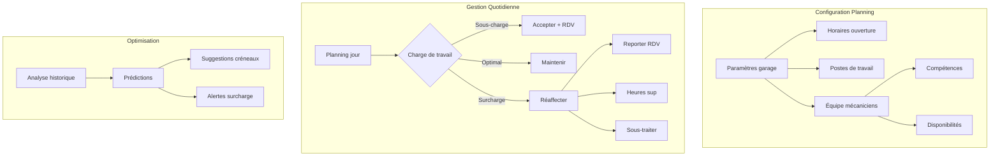

# EPIC 3: Gestion du Planning 🗓️

## Vue d'ensemble

Cette epic concerne la gestion complète du planning du garage, l'affectation des ressources et l'optimisation de la charge de travail.

## Diagramme de flux



## User Stories détaillées

### US-07: Visualisation planning mécanicien

**En tant que** mécanicien  
**Je veux** voir mon planning journalier  
**Afin d'** organiser efficacement mon travail

#### Critères d'acceptation détaillés

1. **Vues disponibles**
   - Vue jour (par défaut)
   - Vue semaine
   - Vue mois
   - Vue liste des tâches

2. **Informations affichées par RDV**
   - Heure début/fin
   - Client (nom, téléphone)
   - Véhicule (marque, modèle, immat)
   - Prestations à réaliser
   - Durée estimée
   - Code couleur par type/urgence
   - État intervention

3. **Interactions possibles**
   - Démarrer/terminer intervention
   - Ajouter notes/photos
   - Signaler retard
   - Demander assistance
   - Consulter historique véhicule

4. **Indicateurs visuels**
   - Charge journée (barre progression)
   - Retards accumulés
   - Pauses planifiées
   - RDV urgents

#### Exemple de planning journalier

```json
{
  "date": "2024-02-15",
  "mecanicien": {
    "id": "MEC-005",
    "nom": "Jean RODRIGUEZ",
    "poste": "P03"
  },
  "horaires_travail": {
    "debut": "08:00",
    "fin": "18:00",
    "pause_dejeuner": {
      "debut": "12:00",
      "fin": "13:00"
    }
  },
  "interventions": [
    {
      "id": "INT-2024-0456",
      "heure_debut": "08:00",
      "heure_fin": "09:30",
      "client": {
        "nom": "MARTIN Sophie",
        "telephone": "0612345678"
      },
      "vehicule": {
        "immatriculation": "CD-789-EF",
        "marque": "Volkswagen",
        "modele": "Golf 7",
        "kilometrage": 65000
      },
      "prestations": [
        "Révision 60000 km",
        "Changement filtre habitacle"
      ],
      "duree_estimee": 90,
      "priorite": "normal",
      "statut": "terminé",
      "duree_reelle": 85,
      "notes": "RAS, client satisfait"
    },
    {
      "id": "INT-2024-0457",
      "heure_debut": "09:30",
      "heure_fin": "10:30",
      "client": {
        "nom": "DURAND Paul",
        "telephone": "0623456789"
      },
      "vehicule": {
        "immatriculation": "GH-123-IJ",
        "marque": "Renault",
        "modele": "Megane 4"
      },
      "prestations": [
        "Diagnostic électronique",
        "Reset voyant moteur"
      ],
      "duree_estimee": 60,
      "priorite": "urgent",
      "statut": "en_cours",
      "notes": "Code défaut P0171 - mélange trop pauvre"
    },
    {
      "id": "INT-2024-0458",
      "heure_debut": "10:30",
      "heure_fin": "12:00",
      "type": "BUFFER",
      "motif": "Retard accumulé + intervention complexe"
    },
    {
      "id": "INT-2024-0459",
      "heure_debut": "13:00",
      "heure_fin": "15:00",
      "client": {
        "nom": "BERNARD Marie",
        "telephone": "0634567890"
      },
      "vehicule": {
        "immatriculation": "KL-456-MN",
        "marque": "Peugeot",
        "modele": "308"
      },
      "prestations": [
        "Changement plaquettes avant",
        "Contrôle disques"
      ],
      "duree_estimee": 120,
      "priorite": "normal",
      "statut": "planifié"
    }
  ],
  "indicateurs": {
    "taux_occupation": 75,
    "retard_accumule_minutes": 15,
    "interventions_terminees": 2,
    "interventions_restantes": 2
  }
}
```

### US-08: Gestion des disponibilités garage

**En tant que** responsable garage  
**Je veux** gérer les disponibilités du garage  
**Afin d'** optimiser la prise de RDV

#### Critères d'acceptation détaillés

1. **Paramétrage horaires**
   - Par jour de la semaine
   - Horaires spéciaux (vacances, fériés)
   - Fermetures exceptionnelles
   - Ouvertures exceptionnelles

2. **Gestion des ressources**
   - Nombre de ponts disponibles
   - Capacité par type d'intervention
   - Zones spécialisées (carrosserie, diagnostic)
   - Matériel spécifique

3. **Gestion équipe**
   - Planning présence mécaniciens
   - Congés et absences
   - Compétences par mécanicien
   - Charge maximale par personne

4. **Règles automatiques**
   - Buffer entre RDV (15 min)
   - Créneaux réservés urgences (20%)
   - Blocage créneaux formation
   - Maintenance préventive équipements

#### Configuration exemple du garage

```json
{
  "garage": {
    "nom": "Garage Central Auto",
    "capacites": {
      "nombre_ponts": 6,
      "nombre_mecaniciens_max": 8,
      "zones_speciales": {
        "carrosserie": 2,
        "diagnostic": 1,
        "controle_technique": 1
      }
    },
    "horaires_standard": {
      "lundi": {"ouverture": "08:00", "fermeture": "18:00"},
      "mardi": {"ouverture": "08:00", "fermeture": "18:00"},
      "mercredi": {"ouverture": "08:00", "fermeture": "18:00"},
      "jeudi": {"ouverture": "08:00", "fermeture": "18:00"},
      "vendredi": {"ouverture": "08:00", "fermeture": "18:00"},
      "samedi": {"ouverture": "09:00", "fermeture": "12:00"},
      "dimanche": "fermé"
    },
    "fermetures_exceptionnelles": [
      {
        "date": "2024-05-01",
        "motif": "Fête du travail"
      },
      {
        "periode": {
          "debut": "2024-08-05",
          "fin": "2024-08-20"
        },
        "motif": "Congés annuels"
      }
    ],
    "regles_planning": {
      "buffer_entre_rdv": 15,
      "pourcentage_urgences": 20,
      "max_rdv_simultanes": 6,
      "duree_min_intervention": 30,
      "duree_max_intervention": 480
    }
  }
}
```

### US-09: Affectation intelligente des RDV

**En tant que** responsable planning  
**Je veux** affecter automatiquement les RDV aux mécaniciens  
**Afin d'** équilibrer la charge de travail

#### Critères d'acceptation détaillés

1. **Critères d'affectation**
   - Compétences requises vs disponibles
   - Charge de travail équilibrée
   - Historique client/mécanicien
   - Proximité géographique des interventions
   - Spécialisation mécanicien

2. **Algorithme d'optimisation**
   - Minimiser temps mort
   - Maximiser taux d'occupation
   - Respecter temps de pause
   - Prioriser urgences
   - Grouper interventions similaires

3. **Ajustements manuels**
   - Drag & drop entre mécaniciens
   - Échange de créneaux
   - Blocage affectation
   - Préférences client

4. **Alertes et suggestions**
   - Surcharge détectée
   - Compétence manquante
   - Optimisation possible
   - Risque de retard

#### Exemple d'affectation optimisée

```json
{
  "date": "2024-02-15",
  "affectations": [
    {
      "mecanicien_id": "MEC-005",
      "competences": ["Mécanique générale", "Diagnostic", "Hybride"],
      "charge_journee": {
        "heures_planifiees": 7.5,
        "heures_disponibles": 8,
        "taux_occupation": 94
      },
      "interventions": [
        {"id": "INT-456", "type": "Révision", "duree": 120},
        {"id": "INT-457", "type": "Diagnostic", "duree": 60},
        {"id": "INT-458", "type": "Freinage", "duree": 90}
      ]
    },
    {
      "mecanicien_id": "MEC-003",
      "competences": ["Carrosserie", "Peinture"],
      "charge_journee": {
        "heures_planifiees": 6,
        "heures_disponibles": 8,
        "taux_occupation": 75
      },
      "interventions": [
        {"id": "INT-459", "type": "Carrosserie", "duree": 240},
        {"id": "INT-460", "type": "Retouche peinture", "duree": 120}
      ]
    }
  ],
  "optimisations_suggerees": [
    {
      "type": "equilibrage_charge",
      "suggestion": "Transférer INT-458 de MEC-005 vers MEC-007",
      "gain_efficacite": "+12%"
    }
  ],
  "alertes": [
    {
      "type": "competence_manquante",
      "message": "Aucun mécanicien disponible pour électronique auto le 16/02",
      "action_suggeree": "Reporter RDV ou faire appel à sous-traitant"
    }
  ]
}
```

## Règles métier spécifiques

- **RG-PLAN-01**: Minimum 15 minutes entre deux RDV du même mécanicien
- **RG-PLAN-02**: Maximum 8h de travail effectif par jour par mécanicien
- **RG-PLAN-03**: Pause obligatoire 30 min si journée > 6h
- **RG-PLAN-04**: 20% du planning réservé aux urgences
- **RG-PLAN-05**: Un mécanicien ne peut avoir plus de 3 interventions complexes par jour
- **RG-PLAN-06**: Rotation obligatoire des mécaniciens le samedi
- **RG-PLAN-07**: Un poste de travail ne peut être occupé plus de 10h/jour

## Indicateurs de performance

- Taux d'occupation moyen des mécaniciens: objectif > 80%
- Temps mort entre interventions: objectif < 10%
- Nombre de reports pour surcharge: objectif < 5/mois
- Équilibrage charge entre mécaniciens: écart max 15%
- Respect des horaires: > 85% des RDV
- Satisfaction équipe sur planning: > 7/10