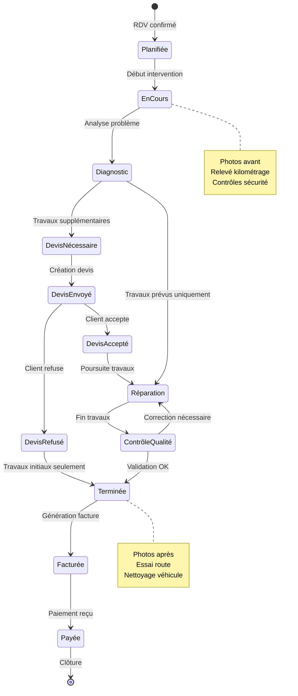

# EPIC 4: Gestion des Interventions 🔧

## Vue d'ensemble

Cette epic couvre tout le cycle de vie d'une intervention, de la documentation technique à la facturation finale.

## Diagramme de flux



## User Stories détaillées

### US-10: Documentation de l'intervention

**En tant que** mécanicien  
**Je veux** documenter précisément l'intervention  
**Afin de** tracer tous les travaux effectués et garantir la qualité

#### Critères d'acceptation détaillés

1. **Check-list d'arrivée véhicule**
   - État général (carrosserie, intérieur)
   - Kilométrage
   - Niveau carburant
   - Objets de valeur signalés
   - Photos 360° véhicule
   - Signature électronique client

2. **Documentation technique**
   - Codes défaut relevés
   - Mesures effectuées
   - Pièces remplacées (ref, n° série)
   - Fluides utilisés (type, quantité)
   - Temps passé par opération
   - Difficultés rencontrées

3. **Contrôles de sécurité**
   - Check-list 25 points
   - Alertes pour points critiques
   - Recommandations futures
   - Validations obligatoires

4. **Clôture intervention**
   - Photos après travaux
   - Essai route (si nécessaire)
   - Nettoyage effectué
   - Remise clés client

#### Exemple de documentation intervention

```json
{
  "intervention_id": "INT-2024-0789",
  "date": "2024-02-15",
  "mecanicien": "Jean RODRIGUEZ",
  "vehicule": {
    "immatriculation": "AB-123-CD",
    "kilometrage_arrivee": 45230,
    "niveau_carburant": "3/4",
    "etat_general": {
      "carrosserie": {
        "note": 4,
        "defauts": ["Rayure aile avant droite", "Poc pare-choc arrière"]
      },
      "interieur": {
        "note": 5,
        "commentaire": "Très propre"
      }
    }
  },
  "travaux_realises": [
    {
      "operation": "Vidange moteur",
      "debut": "09:15",
      "fin": "09:45",
      "details": {
        "huile_vidangee": {
          "quantite": "4.2L",
          "aspect": "Noir, viscosité correcte"
        },
        "huile_neuve": {
          "reference": "5W30-SHELL-HELIX",
          "quantite": "4.5L",
          "lot": "LOT-2024-0125"
        },
        "filtre": {
          "reference": "HU719/6",
          "marque": "MANN FILTER"
        }
      }
    },
    {
      "operation": "Diagnostic électronique",
      "debut": "09:45",
      "fin": "10:15",
      "details": {
        "codes_defaut": [
          {
            "code": "P0171",
            "description": "Mélange trop pauvre banc 1",
            "action": "Nettoyage débitmètre + reset"
          }
        ],
        "valeurs_mesurees": {
          "pression_huile": "3.2 bars",
          "temperature_moteur": "92°C",
          "tension_batterie": "12.6V"
        }
      }
    },
    {
      "operation": "Contrôle freinage",
      "debut": "10:15",
      "fin": "10:45",
      "details": {
        "plaquettes_avant": {
          "epaisseur_gauche": "8mm",
          "epaisseur_droite": "7.5mm",
          "usure": "30%",
          "remplacement_prevu": "Dans 15000km"
        },
        "disques_avant": {
          "epaisseur": "24mm",
          "etat": "Bon",
          "voile": "< 0.05mm"
        }
      }
    }
  ],
  "controles_securite": {
    "eclairage": "OK",
    "pneumatiques": {
      "avant_gauche": {"pression": "2.3 bars", "usure": "5mm"},
      "avant_droit": {"pression": "2.3 bars", "usure": "5mm"},
      "arriere_gauche": {"pression": "2.1 bars", "usure": "6mm"},
      "arriere_droit": {"pression": "2.1 bars", "usure": "6mm"}
    },
    "essuie_glaces": "À remplacer",
    "liquides": {
      "lave_glace": "Complété",
      "liquide_frein": "OK",
      "liquide_refroidissement": "OK"
    }
  },
  "recommandations": [
    {
      "priorite": "haute",
      "description": "Remplacer essuie-glaces avant",
      "delai": "Immédiat"
    },
    {
      "priorite": "moyenne",
      "description": "Prévoir changement plaquettes avant",
      "delai": "15000 km ou 12 mois"
    }
  ],
  "photos": [
    "avant_general.jpg",
    "avant_rayure_aile.jpg",
    "apres_general.jpg",
    "facture_pieces.jpg"
  ],
  "signature_mecanicien": "JR-2024-02-15-11:30",
  "kilometrage_sortie": 45235,
  "essai_route": {
    "effectue": true,
    "distance": "5km",
    "commentaire": "RAS, véhicule OK"
  }
}
```

### US-11: Création et gestion des devis

**En tant que** garage  
**Je veux** créer des devis détaillés  
**Afin de** faire valider les travaux par le client

#### Critères d'acceptation détaillés

1. **Création devis**
   - Génération automatique depuis diagnostic
   - Ajout manuel lignes supplémentaires
   - Calcul automatique main d'œuvre
   - Application remises
   - Durée de validité paramétrable

2. **Contenu devis**
   - Détail par opération
   - Temps estimé
   - Prix pièces et MO séparés
   - TVA détaillée
   - Conditions générales
   - Garanties applicables

3. **Gestion des versions**
   - Historique modifications
   - Comparaison versions
   - Traçabilité validations

4. **Signature électronique**
   - Envoi par email/SMS
   - Signature en ligne
   - Relances automatiques
   - Archivage légal

#### Exemple de devis

```json
{
  "devis_numero": "DEV-2024-0234",
  "date_creation": "2024-02-15",
  "validite_jusqu_au": "2024-03-15",
  "client": {
    "nom": "DUPONT Jean",
    "adresse": "15 rue de la République 75001 PARIS",
    "telephone": "0612345678",
    "email": "jean.dupont@email.fr"
  },
  "vehicule": {
    "marque": "Renault",
    "modele": "Clio V",
    "immatriculation": "AB-123-CD",
    "vin": "VF1RJA00064512345",
    "kilometrage": 45230
  },
  "lignes_devis": [
    {
      "categorie": "Main d'œuvre",
      "items": [
        {
          "designation": "Remplacement plaquettes frein avant",
          "quantite": 1,
          "temps_minutes": 60,
          "taux_horaire": 70,
          "prix_unitaire_ht": 70,
          "total_ht": 70
        },
        {
          "designation": "Remplacement disques frein avant",
          "quantite": 1,
          "temps_minutes": 30,
          "taux_horaire": 70,
          "prix_unitaire_ht": 35,
          "total_ht": 35
        }
      ]
    },
    {
      "categorie": "Pièces",
      "items": [
        {
          "designation": "Kit plaquettes avant BOSCH",
          "reference": "0986494654",
          "quantite": 1,
          "prix_unitaire_ht": 65,
          "total_ht": 65
        },
        {
          "designation": "Disques frein avant BREMBO (paire)",
          "reference": "09.A967.11",
          "quantite": 1,
          "prix_unitaire_ht": 120,
          "total_ht": 120
        }
      ]
    },
    {
      "categorie": "Consommables",
      "items": [
        {
          "designation": "Nettoyant frein",
          "quantite": 1,
          "prix_unitaire_ht": 5,
          "total_ht": 5
        }
      ]
    }
  ],
  "totaux": {
    "total_main_oeuvre_ht": 105,
    "total_pieces_ht": 185,
    "total_consommables_ht": 5,
    "sous_total_ht": 295,
    "remise": {
      "type": "pourcentage",
      "valeur": 10,
      "montant": 29.50
    },
    "total_ht_apres_remise": 265.50,
    "tva": {
      "taux": 20,
      "montant": 53.10
    },
    "total_ttc": 318.60
  },
  "conditions": {
    "delai_realisation": "2 jours",
    "garantie_pieces": "24 mois",
    "garantie_main_oeuvre": "12 mois",
    "modalites_paiement": "À réception",
    "acompte_demande": 0
  },
  "statut": "En attente signature",
  "historique": [
    {
      "date": "2024-02-15T14:00:00Z",
      "action": "Création",
      "auteur": "Marie DUBOIS"
    },
    {
      "date": "2024-02-15T14:30:00Z",
      "action": "Envoi client",
      "canal": "email"
    }
  ],
  "signature": {
    "demandee": true,
    "obtenue": false,
    "url_signature": "https://garage.fr/devis/sign/DEV-2024-0234"
  }
}
```

### US-12: Facturation et paiement

**En tant que** garage  
**Je veux** facturer les interventions  
**Afin d'** être payé pour les travaux effectués

#### Critères d'acceptation détaillés

1. **Génération facture**
   - Automatique depuis intervention terminée
   - Reprise du devis accepté
   - Numérotation séquentielle
   - Format PDF normalisé

2. **Modes de paiement**
   - CB sur place
   - Virement
   - Chèque
   - Espèces (limite légale)
   - Paiement en 3x sans frais
   - Financement (partenaire)

3. **Gestion des impayés**
   - Relances automatiques (J+7, J+15, J+30)
   - Majoration retard
   - Export contentieux
   - Blocage nouveau RDV

4. **Intégration comptable**
   - Export format comptable
   - Ventilation TVA
   - Journal des ventes
   - Rapprochement bancaire

#### Exemple de facture

```json
{
  "facture_numero": "FAC-2024-0456",
  "date_emission": "2024-02-15",
  "date_echeance": "2024-03-15",
  "reference_intervention": "INT-2024-0789",
  "reference_devis": "DEV-2024-0234",
  "emetteur": {
    "raison_sociale": "Garage Central Auto",
    "siret": "12345678900001",
    "adresse": "10 avenue du Garage, 75010 PARIS",
    "telephone": "0140506070",
    "email": "contact@garage-central.fr",
    "tva_intracommunautaire": "FR12345678900"
  },
  "client": {
    "type": "particulier",
    "nom": "DUPONT Jean",
    "adresse": "15 rue de la République 75001 PARIS",
    "email": "jean.dupont@email.fr"
  },
  "lignes_facture": [
    {
      "designation": "Main d'œuvre - Freinage",
      "quantite": 1.5,
      "prix_unitaire_ht": 70,
      "total_ht": 105
    },
    {
      "designation": "Kit plaquettes avant BOSCH - Ref: 0986494654",
      "quantite": 1,
      "prix_unitaire_ht": 65,
      "total_ht": 65
    },
    {
      "designation": "Disques frein avant BREMBO - Ref: 09.A967.11",
      "quantite": 1,
      "prix_unitaire_ht": 120,
      "total_ht": 120
    }
  ],
  "totaux": {
    "base_ht": 290,
    "remise_fidelite": 29,
    "total_ht": 261,
    "tva_20": 52.20,
    "total_ttc": 313.20
  },
  "paiement": {
    "mode": "CB",
    "statut": "payé",
    "date_paiement": "2024-02-15",
    "reference_transaction": "CB-2024-0789",
    "montant_regle": 313.20,
    "solde_du": 0
  },
  "mentions_legales": {
    "penalites_retard": "3 fois le taux d'intérêt légal",
    "indemnite_forfaitaire": "40€",
    "escompte": "Aucun escompte pour paiement anticipé",
    "garantie": "Pièces: 24 mois, Main d'œuvre: 12 mois"
  },
  "documents_joints": [
    "rapport_intervention.pdf",
    "photos_avant_apres.zip"
  ]
}
```

## Règles métier spécifiques

- **RG-INT-01**: Photos obligatoires avant/après pour tout véhicule client
- **RG-INT-02**: Essai route obligatoire après intervention sur freinage/direction
- **RG-INT-03**: Devis obligatoire si dépassement > 10% du montant initial
- **RG-INT-04**: Signature client requise pour travaux > 500€
- **RG-INT-05**: Conservation documents intervention 10 ans
- **RG-INT-06**: Facturation immédiate si client blacklisté
- **RG-INT-07**: Remise fidélité automatique après 5 interventions (-10%)
- **RG-INT-08**: Validation responsable si remise > 20%

## Indicateurs de performance

- Temps moyen documentation intervention: < 10 min
- Taux de devis acceptés: > 70%
- Délai moyen facturation: < 24h
- Taux impayés: < 2%
- Satisfaction client intervention: > 4.5/5
- Taux de retour SAV: < 3%