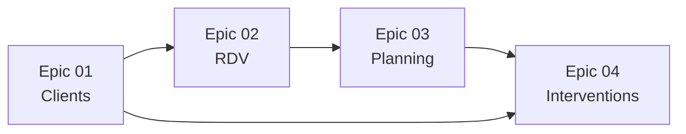

# 🎯 Épics - My Garage

## 📋 Vue d'ensemble

Cette section contient les 4 épics principales qui structurent les fonctionnalités de l'application My Garage. Chaque epic regroupe plusieurs user stories et décrit en détail les besoins fonctionnels.

## 📑 Liste des Épics

### 👤 [EPIC 01 - Gestion des Clients](./EPIC-01-gestion-clients.md)
**Objectif** : Gérer les comptes clients, leurs véhicules et leur historique d'interventions.

**User Stories incluses :**
- **[US-01](./EPIC-01-gestion-clients.md#us-01-création-de-compte-client)** - Création de compte client
- **[US-02](./EPIC-01-gestion-clients.md#us-02-gestion-des-véhicules)** - Gestion des véhicules
- **[US-03](./EPIC-01-gestion-clients.md#us-03-consultation-historique)** - Consultation historique

**Fonctionnalités clés :**
- Inscription et authentification
- Profil client et préférences
- Gestion du parc automobile
- Historique des interventions

---

### 📅 [EPIC 02 - Prise de RDV](./EPIC-02-prise-rdv.md)
**Objectif** : Gérer tout le processus de prise, modification et annulation de rendez-vous.

**User Stories incluses :**
- **[US-04](./EPIC-02-prise-rdv.md#us-04-prise-de-rdv-en-ligne)** - Prise de RDV en ligne
- **[US-05](./EPIC-02-prise-rdv.md#us-05-modificationannulation-de-rdv)** - Modification/Annulation de RDV
- **[US-06](./EPIC-02-prise-rdv.md#us-06-validation-rdv-par-le-garage)** - Validation RDV par le garage

**Fonctionnalités clés :**
- Réservation en ligne
- Calcul automatique des durées
- Notifications et rappels
- Gestion des annulations

---

### 🗓️ [EPIC 03 - Planning](./EPIC-03-planning.md)
**Objectif** : Gérer la planification optimale des ressources et l'affectation des rendez-vous.

**User Stories incluses :**
- **[US-07](./EPIC-03-planning.md#us-07-visualisation-planning-mécanicien)** - Visualisation planning mécanicien
- **[US-08](./EPIC-03-planning.md#us-08-gestion-des-disponibilités-garage)** - Gestion des disponibilités garage
- **[US-09](./EPIC-03-planning.md#us-09-affectation-intelligente-des-rdv)** - Affectation intelligente des RDV

**Fonctionnalités clés :**
- Planning temps réel
- Gestion des capacités
- Affectation automatique
- Optimisation des ressources

---

### 🔧 [EPIC 04 - Interventions](./EPIC-04-interventions.md)
**Objectif** : Couvrir tout le cycle de vie d'une intervention, de la documentation à la facturation.

**User Stories incluses :**
- **[US-10](./EPIC-04-interventions.md#us-10-documentation-de-lintervention)** - Documentation de l'intervention
- **[US-11](./EPIC-04-interventions.md#us-11-création-et-gestion-des-devis)** - Création et gestion des devis
- **[US-12](./EPIC-04-interventions.md#us-12-facturation-et-paiement)** - Facturation et paiement

**Fonctionnalités clés :**
- Suivi des interventions
- Gestion des devis
- Contrôle qualité
- Facturation automatisée

## 📊 Matrice des Dépendances

**Séquence de développement recommandée :**
1. **Epic 01** - Base clients nécessaire pour les RDV
2. **Epic 02** - Système de réservation
3. **Epic 03** - Optimisation du planning
4. **Epic 04** - Gestion complète des interventions

## 🔄 État d'avancement par Epic

| Epic | Status | User Stories | Complexité |
|------|--------|--------------|------------|
| [Epic 01](./EPIC-01-gestion-clients.md) | ✅ Spécifiée | 3/3 définies | Moyenne |
| [Epic 02](./EPIC-02-prise-rdv.md) | ✅ Spécifiée | 3/3 définies | Élevée |
| [Epic 03](./EPIC-03-planning.md) | ✅ Spécifiée | 3/3 définies | Très élevée |
| [Epic 04](./EPIC-04-interventions.md) | ✅ Spécifiée | 3/3 définies | Élevée |

## 🔗 Navigation

- **[📚 Documentation principale](../index.md)**
- **[📐 Règles métier](../business-rules/index.md)**
- **[🏠 Accueil du projet](../../index.md)**

---
*Dernière mise à jour : Octobre 2025*