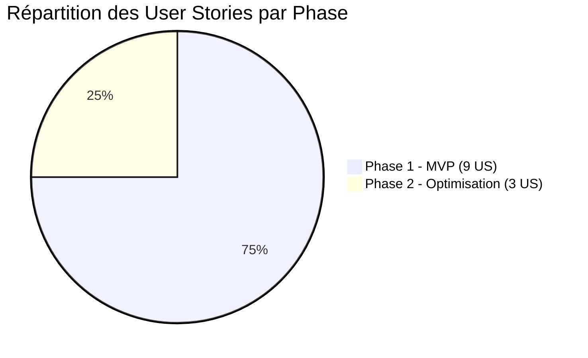
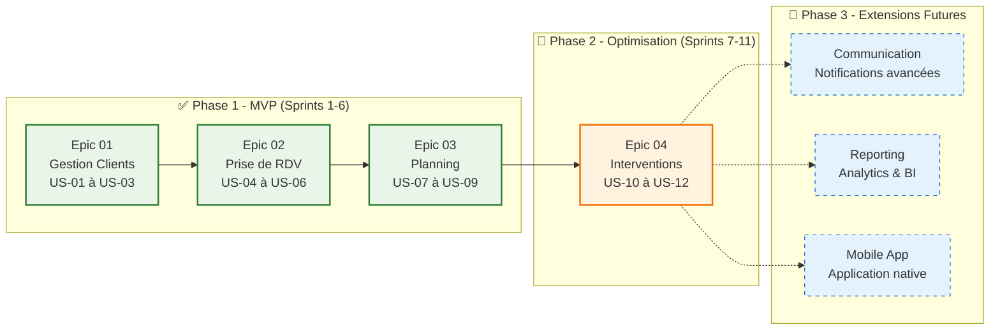

# 🚗 My Garage - Documentation Index

## 📋 Vue d'ensemble

Bienvenue dans la documentation complète de l'application **My Garage** - une solution de gestion de rendez-vous pour garage automobile.

## 🗂️ Navigation Principale

### 📚 Documentation Technique
- **[README Principal](./README.md)** - Description générale du projet, objectifs et roadmap
- **[Documentation Détaillée](./docs/index.md)** - Accès à toute la documentation technique

### 🎯 Épics & Fonctionnalités
- **[EPIC 01 - Gestion des Clients](./docs/epics/EPIC-01-gestion-clients.md)** - Comptes clients et véhicules
- **[EPIC 02 - Prise de RDV](./docs/epics/EPIC-02-prise-rdv.md)** - Système de réservation
- **[EPIC 03 - Planning](./docs/epics/EPIC-03-planning.md)** - Gestion des ressources et planification
- **[EPIC 04 - Interventions](./docs/epics/EPIC-04-interventions.md)** - Cycle de vie des interventions

### 📐 Règles Métier
- **[Règles Métier](./docs/business-rules/BUSINESS-RULES.md)** - Contraintes et règles de gestion

### 📅 Planning & Stratégie
- **[📅 Planning Stratégique](./docs/PLANNING-STRATEGIQUE.md)** - Roadmap 11 sprints et milestones
- **[🏗️ Guide d'Organisation](./docs/GUIDE-ORGANISATION.md)** - Méthodologie et séquencement
- **[📋 Issues GitHub](https://github.com/tgrall/my-garage/issues)** - Épics et User Stories

## 🔍 User Stories par Epic

### 👤 Gestion des Clients (EPIC 01)
- **US-01** - Création de compte client
- **US-02** - Gestion des véhicules
- **US-03** - Consultation historique

### 📅 Prise de RDV (EPIC 02)
- **US-04** - Prise de RDV en ligne
- **US-05** - Modification/Annulation de RDV
- **US-06** - Validation RDV par le garage

### 🗓️ Planning (EPIC 03)
- **US-07** - Visualisation planning mécanicien
- **US-08** - Gestion des disponibilités garage
- **US-09** - Affectation intelligente des RDV

### 🔧 Interventions (EPIC 04)
- **US-10** - Documentation de l'intervention
- **US-11** - Création et gestion des devis
- **US-12** - Facturation et paiement

## 🚀 Comment naviguer

1. **Pour une vue d'ensemble** : Commencez par le [README principal](./README.md)
2. **Pour les détails techniques** : Explorez le dossier [docs/](./docs/index.md)
3. **Pour une fonctionnalité spécifique** : Accédez directement à l'epic correspondant
4. **Pour les contraintes** : Consultez les [règles métier](./docs/business-rules/BUSINESS-RULES.md)

## 📊 État d'avancement

- ✅ **Phase 1 (MVP)** : Epics 01, 02, 03 - Fonctionnalités de base
- 🔄 **Phase 2** : Epic 04 - Gestion complète des interventions
- 📅 **Phase 3** : Extensions futures (communication, reporting)

---
*Dernière mise à jour : Octobre 2025*